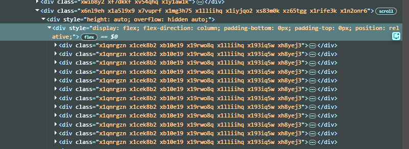

# Instagram Unfollowers

Small Python script that extracts Instagram **followers** and **following** usernames from HTML, and writes the results to JSON.

## What you need

- Python 3.10+ recommended
- Your HTML files in this folder:
  - `followers.html`
  - `following.html`

## Getting `followers.html` / `following.html` from the browser

Open Instagram in your browser, open DevTools (F12), go to the **Elements** tab, and select the main scrollable container that contains the list of users (like in the screenshot). Then **Copy → Copy element** and paste the result into a file named `followers.html` or `following.html`.



## Run

From this project directory:

```bash
python extract_followers.py --followers followers.html --following following.html --sort --compare
```

## Outputs

Running the command above writes:

- `followers.json`
- `following.json`
- `comparison.json` (only when `--compare` is used)

### `followers.json` / `following.json` format

```json
{
  "count": 123,
  "usernames": ["user1", "user2"]
}
```

### `comparison.json` format

- `mutual`: users you follow **and** who follow you back
- `not_following_back`: users you follow who **don’t** follow you back
- `not_followed_back`: users who follow you that **you don’t** follow

```json
{
  "followers_count": 123,
  "following_count": 80,
  "mutual_count": 50,
  "not_following_back_count": 30,
  "not_followed_back_count": 73,
  "mutual": [],
  "not_following_back": [],
  "not_followed_back": []
}
```

## Options

- `--followers PATH`: path to `followers.html` (default: `followers.html`)
- `--following PATH`: path to `following.html` (default: `following.html`)
- `--sort`: sort usernames alphabetically (default keeps file order)
- `--compare`: also generate `comparison.json`
- `--out BASENAME`: change output names:
  - `<BASENAME>_followers.json`
  - `<BASENAME>_following.json`
  - `<BASENAME>_comparison.json` (with `--compare`)

Example:

```bash
python extract_followers.py --out ig --compare
```

Writes `ig_followers.json`, `ig_following.json`, `ig_comparison.json`.

